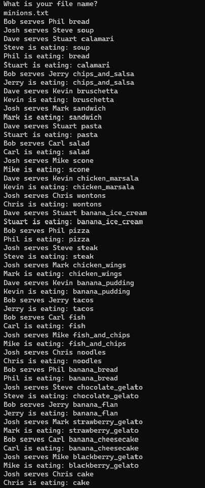
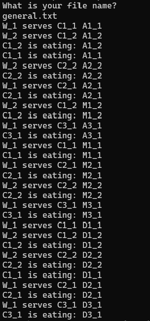

# Restaurant_Service_Simulation

## A restaurant service simulation utilizing synchronized object for multi-threading in Java
* [Restaurant.jar](Restaurant.jar) is the executable jar file for this application.
* [minions.txt](minions.txt) and [general.txt](general.txt) are both example input files for **[Restaurant.jar](Restaurant.jar)**
* The [src/restaurant](src/restaurant) contains 4 java files, [Restaurant](src/restaurant/Restaurant.java), [Customer](src/restaurant/Customer.java), 
 [Table](src/restaurant/Table.java), and [Waiter](src/restaurant/Waiter.java), and the `main()` method is inside [Restaurant](src/restaurant/Restaurant.java)
* The [doc](doc) contains the Jaca Docs for all the aforementioned java files.
* [minions_out.png](minions_out.png) / [general_out.png](general_out.png) are the screenshots of example outputs from **[Restaurant.jar](Restaurant.jar)**

## Details:
1. **[Restaurant](src/restaurant/Restaurant.java)** : takes in a `.txt` file in the same directory and starts the restaurant service simulation
2. **[Customer](src/restaurant/Customer.java)**: contains a synchronization object for multi-threading and a `Customer` object that simulates a customer behavior of consuming three courses in the specified order according to the  `.txt` file
3. **[Waiter](src/restaurant/Waiter.java)**: contains a synchronization object for multi-threading and a `Waiter` object that simulates a waiter's behavior of serving courses in the specified order according the  `.txt` file.
4. **[Table](src/restaurant/Table.java)**: contains a `Table` object simulating a table where the served courses are placed
5. **[minions.txt](minions.txt)** / **[general.txt](general.txt)** : 

* The first line specifies the number of waiters :  **arbitrary** positive integer number
* All the lines starting from the second line are in the same format:

`waiter1_name`  `num_of_customers_handled` `customer1_name` `appetizer1_1` `meal1_1` `dessert1_1` `customer2_name` `appetizer2_1` `meal2_1` `dessert2_1` ...

=> `waiter1_name` has  to serve `num_of_customers_handled` customers who are `customer1_name`, `customer2_name` ...  and the **serving order has to follow the ordering order**, namely `appetizeri_1` `meali_1` `desserti_1` for `customeri_name`;  

### For example:

`Bob` `2` `Phil` `bread` `pizza` `banana_bread` `Jerry` `chips_and_salsa` `tacos` `banana_flan` 

## Final Example Outputs 

https://user-images.githubusercontent.com/84282744/185836584-a01f2234-9d2e-4af9-a9d2-3393e99ee233.mp4

Outputs Screenshots
---
**left**: outputs for [minions.txt]([minions.txt) vs **right**: outputs for [general.txt](general.txt)

    
    

